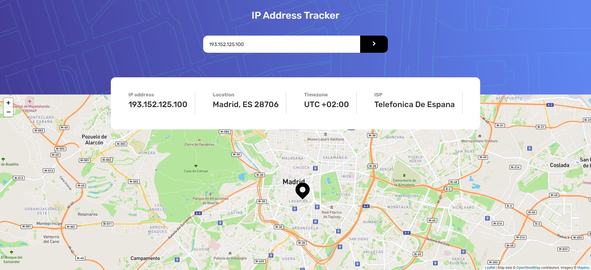
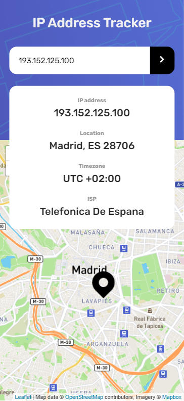

# Frontend Mentor - IP address tracker solution

This is a solution to the [IP address tracker challenge on Frontend Mentor](https://www.frontendmentor.io/challenges/ip-address-tracker-I8-0yYAH0). Frontend Mentor challenges help you improve your coding skills by building realistic projects.

## Table of contents

- [Overview](#overview)
  - [Links](#links)
  - [Author](#author)
  - [The challenge](#the-challenge)
  - [Screenshot](#screenshot)
- [My process](#my-process)
  - [Built with](#built-with)
  - [Useful resources](#useful-resources)

## Overview

### Links

- Solution URL: [Ip Address Tracker](https://ip-address-tracker-borja.netlify.app/)

### Author

- Linkedin - [borjariveiro](https://www.linkedin.com/in/borjariveiro/)
- GitHub - [borjariveiro](https://github.com/Borja-Riveiro)

### The challenge

Users should be able to:

- View the optimal layout for each page depending on their device's screen size
- See hover states for all interactive elements on the page
- See their own IP address on the map on the initial page load
- Search for any IP addresses or domains and see the key information and location

### Screenshot

## My process

### Built with

- Semantic HTML5 markup
- CSS custom properties
- Flexbox
- Sass
- Mobile-first workflow'
- Gulp workflow
- Fetch and promises with async/await
- Deploy with Netlify

### Useful resources

- [CSS-TRICKS Flexbox](https://css-tricks.com/snippets/css/a-guide-to-flexbox/)
- [JavaScript](https://es.javascript.info/)
